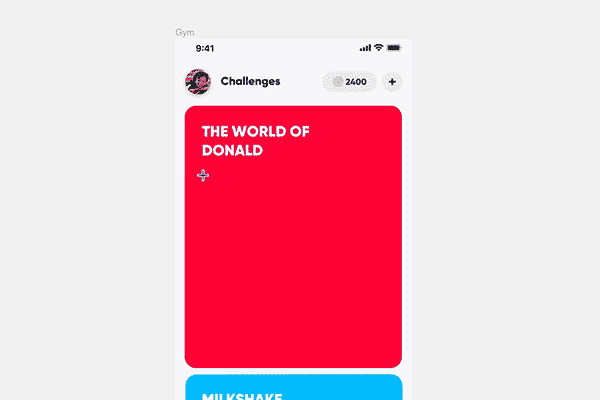
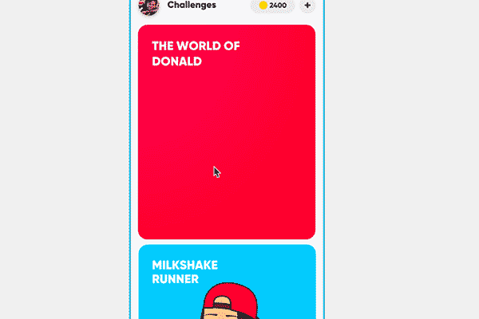
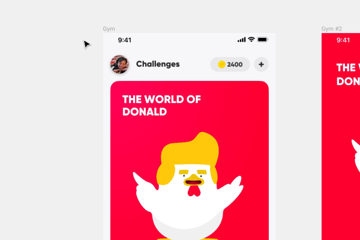

# Tacos

### Installations
- python >= 3.6
- virtualenv
- rabbitmq (https://www.rabbitmq.com/download.html)
- Figma App (https://www.figma.com/developers/apps)

### Running the app
- copy the *.env.example* file into *.env*, and fill the values according to your needs:
    - LOCAL_FOLDER_LOTTIE_FILES is the absolute path of the folder the lottie files and metadata will be saved in
    - CONSERVATION_TIME is the number of seconds after which lottie files and their metadata will be deleted
    - DEBUG activates Django's debug
    - HOST is the url of the API
    - FRONT is the url of the front-end
    - SECRET_KEY is secret!
    - FIGMA_API_URL is the url of the Figma API you use (if you don't want to host it, use *https://api.figma.com/v1*)
    - FIGMA_APP_CLIENT_ID and FIGMA_APP_CLIENT_SECRET are the credentials of your Figma app
- create a virtualenv in the project root (*tacos* folder) with *virtualenv -p python3 env*, activate it with *source env/bin/activate* and set up the environment with *pip install -r requirements.txt*
- run Rabbitmq with *rabbitmq-server*
- run your app with *python manage.py runserver <hostname>:<port>*, and you're ready to go (Celery will automatically start by running the *manage.py* with *celery -A tacos worker -l info*)

## Tutorial
### 1. Setup your animation in Figma.
In Figma, create a frame named @lottie. That’s where your animation will be rendered. It gets its size and position from that rectangle.

### 2. [Optional] Control the animation by commenting with code:
{
   “arguments”: {
      “loop”: false,
      ”speed”: 5,
   }
}

### 3. Paste the canvas link and add the animation file(s)
On Figma Lottie, you’ll be able to connect to your Figma account and paste your Frame link. Then, upload your Lottie files and enjoy your animated mockup :tada: Edit your animations files or Figma canvas and update the render until you’re happy with the result.

